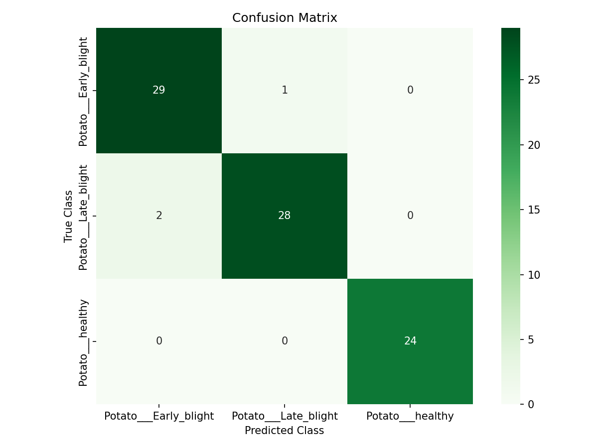
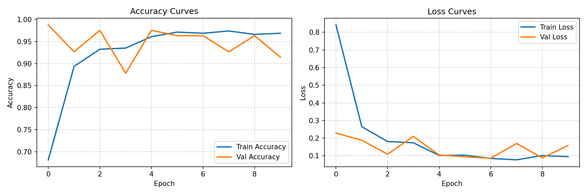

# LeafGuard — Plant Disease Classifier

An end-to-end image classification system designed to diagnose plant leaf health from photos, exposing the model via a FastAPI backend and a responsive dark-themed web user interface.

## 1. Problem Statement
In industrial agriculture, early detection of plant leaf pathogens is critical to preventing crop loss and optimizing pesticide applications. This project implements a machine learning system to classify potato leaf images into their respective health states (Healthy, Early Blight, or Late Blight), providing farmers and agronomists with an instantaneous diagnostic recommendation through an API-powered web application.

---

## 2. Dataset
*   **Source:** The public **PlantVillage dataset** (hosted on Kaggle).
*   **Total Scope:** Originally ~54,000 images across 38 crop-disease categories.
*   **Our Scoped Subset:** 
    *   **Crop:** Potato
    *   **Classes Used:** 3 categories:
        1.  `Potato___Early_blight` (Alternaria solani) — 200 images subset.
        2.  `Potato___Late_blight` (Phytophthora infestans) — 200 images subset.
        3.  `Potato___healthy` — 152 images subset (entirety of available healthy potato class).
    *   **Data Partitioning:** Stratified splitting of 70% Train, 15% Validation, and 15% Test.
*   **Why this Scoping Decision?**
    Training a deep learning network on all 38 classes requires massive GPU resources and lengthy training times. For this project, scoping to a single crop (Potato) with 3 classes restricts the domain boundaries to highly meaningful agricultural symptoms, ensuring the training completes under 2 minutes on CPU while demonstrating proper stratification and data split practices.

---

## 3. Machine Learning Approach
We used **Transfer Learning** with a pre-trained **MobileNetV2** base architecture.

*   **Why MobileNetV2?**
    Unlike heavy networks like ResNet50, MobileNetV2 uses depthwise separable convolutions to dramatically reduce the number of parameters (3.4M vs. 25M) and computation time, making it lightweight enough to run and serve on modest CPU hosts.
*   **Training Configuration:**
    *   **Frozen Backbone:** All MobileNetV2 layers are frozen with pre-trained ImageNet weights to act as a robust feature extractor.
    *   **Custom Head:** Added a `GlobalAveragePooling2D` equivalent, a `Dense(128, ReLU)` layer for classification representation, `Dropout(0.3)` for regularization against overfitting, and a final `Dense(3, Softmax)` output layer.
    *   **Optimization:** Compiled with the Adam optimizer (Learning Rate = `1e-3`) and Categorical Cross-Entropy loss.
    *   **Regularization:** Real-time data augmentation (horizontal/vertical flips, ±20% rotations, ±10% zooms, ±10% brightness) is applied inside the Keras computational graph during training. Early stopping with a patience of 3 epochs was configured to prevent overfitting by monitoring validation loss.

---

## 4. Results & Performance
The model was evaluated on a held-out test set (84 images total) which was completely unseen during training.

### Test Set Performance
*   **Overall Accuracy:** **96%**
*   **Per-Class Metrics:**
    *   `Potato___Early_blight`: Precision: **94%**, Recall: **97%**, F1-Score: **95%**
    *   `Potato___Late_blight`: Precision: **97%**, Recall: **93%**, F1-Score: **95%**
    *   `Potato___healthy`: Precision: **100%**, Recall: **100%**, F1-Score: **100%**

Detailed results are available at:
*   [Classification Report Text](evaluation/classification_report.txt)
*   [Confusion Matrix Image](evaluation/confusion_matrix.png)
*   [Training Curves Plot](evaluation/training_curves.png)

### Model Visualizations
#### Confusion Matrix


#### Training Curves


### Key Observations
*   **High Separability of Healthy Leaves:** The model achieved a perfect 100% precision and recall on the `Potato___healthy` class. In an interview context, this is a point worth highlighting: healthy foliage in the PlantVillage dataset is extremely clean, uniform green, and entirely lacks any necrotic patches or chlorosis (yellowing). This high visual contrast makes it highly separable for the pre-trained CNN.
*   **Blight Boundary Confusion:** The minor errors occurred solely between `Early_blight` and `Late_blight` (2 images of early blight predicted as late blight, and 2 images of late blight predicted as early blight). This is visually expected; both present as brownish spots on leaf surfaces. Early blight features concentric targets, while late blight shows water-soaked lesions, representing a much tighter, more challenging decision boundary than healthy leaves.

---

## 5. System Limitations
As a candidate for a data science role, it is critical to address these real-world caveats:
1.  **Lab Conditions Bias:** The PlantVillage dataset features leaves photographed against uniform, clean gray/white backgrounds under artificial lighting. In a production field, leaves are photographed on trees with background noise (soil, hands, sunlight glare, multiple overlapping leaves). The model may struggle to generalize to noisy real-world fields.
2.  **Scope Limitations:** The classifier only knows 3 potato classes. If an user uploads a grape leaf, a weed, or a completely different crop, the model will confidently predict one of the three potato classes due to the closed softmax layer.
3.  **No Severity Metric:** The model outputs a categorical label, but does not identify the percentage of leaf area damaged (disease severity), which is critical for prescriptive pesticide applications.

---

## 6. How to Run Locally

### Prerequisites
*   Python 3.11+
*   Docker (Optional, for containerized run)

### Method A: Local Python Environment
1.  **Clone / Copy the directory**
2.  **Set up Virtual Environment:**
    ```bash
    python -m venv venv
    .\venv\Scripts\activate
    ```
3.  **Install dependencies:**
    ```bash
    pip install -r app/requirements.txt
    ```
4.  *(Optional)* **Re-prepare data and retrain:**
    To download raw images, partition them, and retrain the Keras model:
    ```bash
    python notebooks/prepare_data.py
    python notebooks/train_model.py
    ```
5.  **Start the FastAPI server:**
    ```bash
    uvicorn app.main:app --reload --host 127.0.0.1 --port 8000
    ```
6.  **Access the web interface:**
    Open your browser and navigate to `http://localhost:8000`. You can upload sample images from `data/test/` to test the API predictions.

### Method B: Docker Container
1.  Ensure you have Docker and Docker Compose installed.
2.  **Build and run the container:**
    ```bash
    docker-compose up --build
    ```
3.  Navigate to `http://localhost:8000` to interact with the containerized application.

---

## 7. Future Roadmap & Improvements
With more time, compute budget, and diverse datasets, the following steps would improve the product:
*   **Diverse Data Augmentation:** Use Albumentations to inject background noise, shadows, and blur to mimic field photography conditions.
*   **Open-World Classification:** Append an "Out-of-Distribution" (OOD) detector or class to reject non-leaf images instead of forcing a prediction.
*   **Model Optimization:** Implement post-training quantization (FP16 or INT8) via TensorFlow Lite to reduce model size (~13MB to ~3MB) for sub-millisecond edge deployment on mobile/IoT devices.
*   **Azure Deployment:** Host the docker image on Azure Container Registry (ACR) and deploy as an Azure Web App for Containers, linking to an Azure Blob Storage system to collect user-submitted images for continuous active-learning loops.
